# Auth0 Set-up

## How to create an account
Selecciona el tipo de cuenta "Personal" y le da siguiente.

<h1 align="center">
  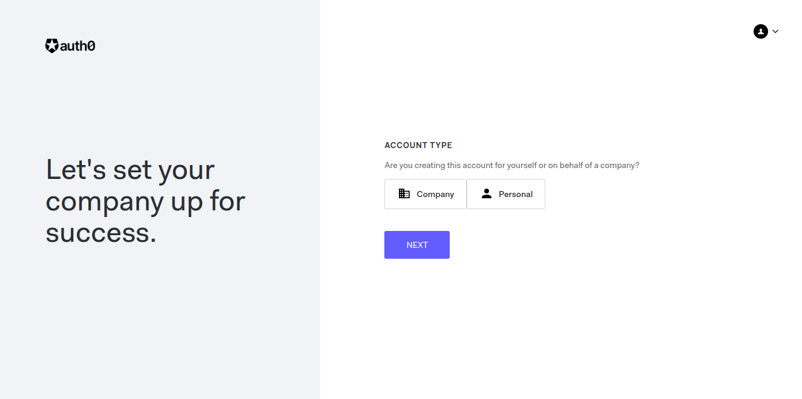
</h1>

Elige un nombre para el dominio y la region donde se hospedaran los datos, y finalmente le da en crear cuenta.

<h1 align="center">
  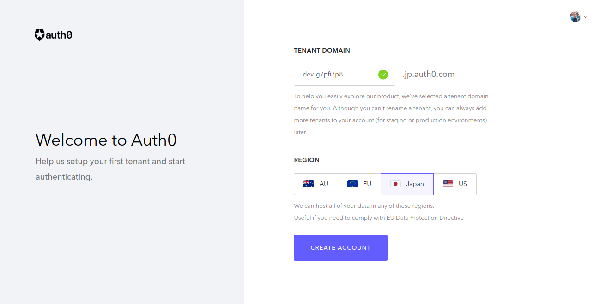
</h1>

Y listo, lo mandara al dashboard de Auth0.

<h1 align="center">
  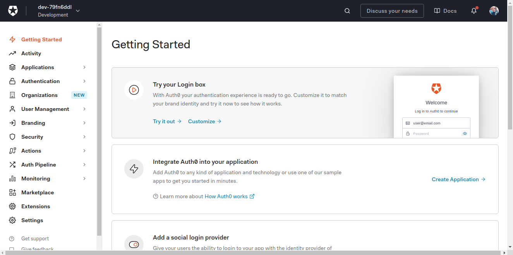
</h1>

 

## Configure your first Auth0 application
Primero se dirige a la barra lateral y selecciona "Applications->Applications" y se mostrara esto.

<h1 align="center">
  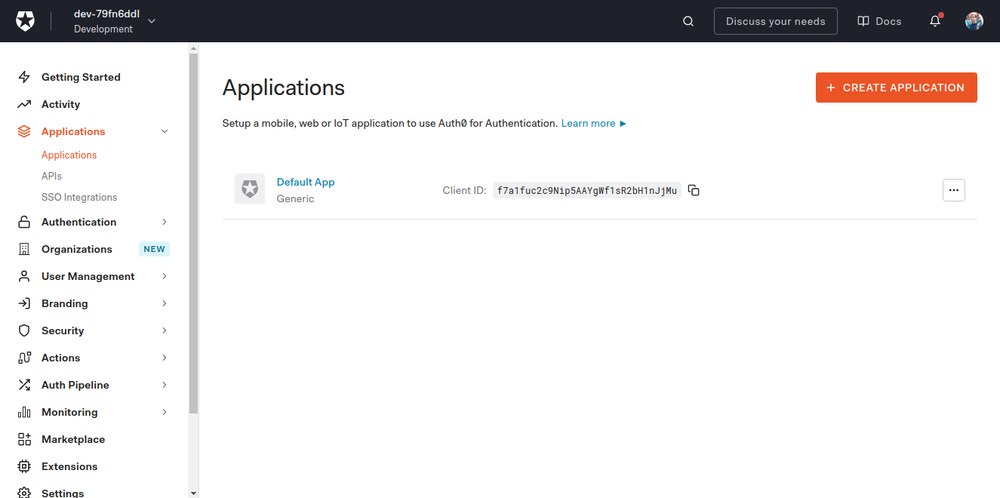
</h1>

Despues selecciona en donde dice "Create application" y le mostrara un campo para elegir el nombre de la aplicacion y de que tipo es su aplicacion. Lo anterior se podra cambiar una vez se cree su aplicacion.

<h1 align="center">
  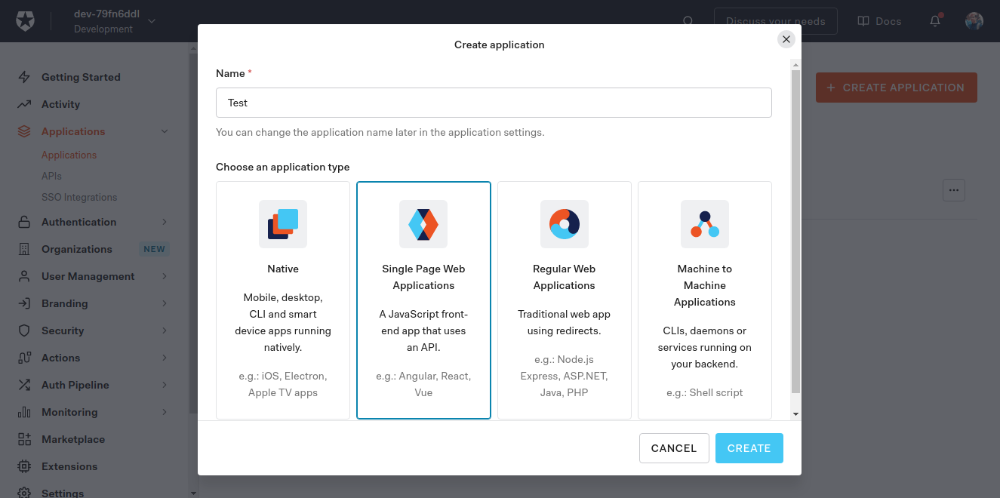
</h1>

Despues lo que se cree su aplicacion lo mandaran a este panel, en donde podra consultar todo los secretos necesarios para conectarlo con sus otras aplicaciones exteriores.

<h1 align="center">
  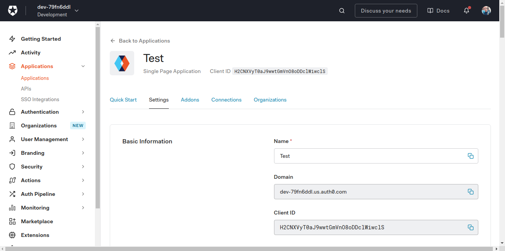
</h1>

Bajando hasta el apartado de "Application URIs" encontrara los campos de "Allowed Callback URLs", "Allowed Logout URLs", "Allowed Web Origins" y "Allowed Origins (CORS)".

<h1 align="center">
  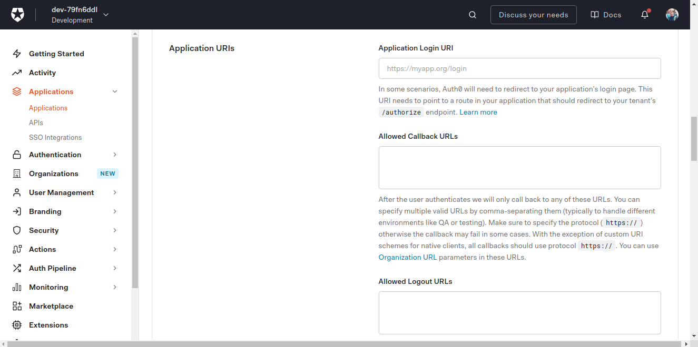
</h1>
<h1 align="center">
  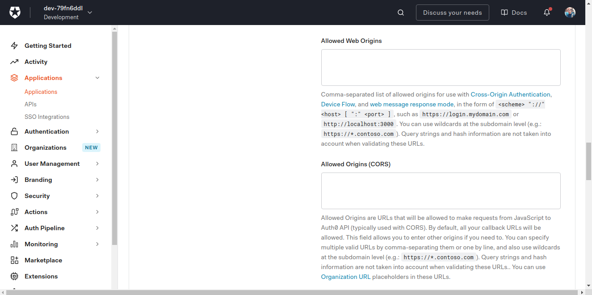
</h1>

Ahora rellene los campos con la URL de donde se enviaran peticiones a Auth0. Ejemplo de dominio de app: https://subdomain.my-page.com/
En "Allowed Callback URLs" el URL debe de se por protocolo https, en los demas pueden ser por http. Y al final guarda los cambios.

<h1 align="center">
  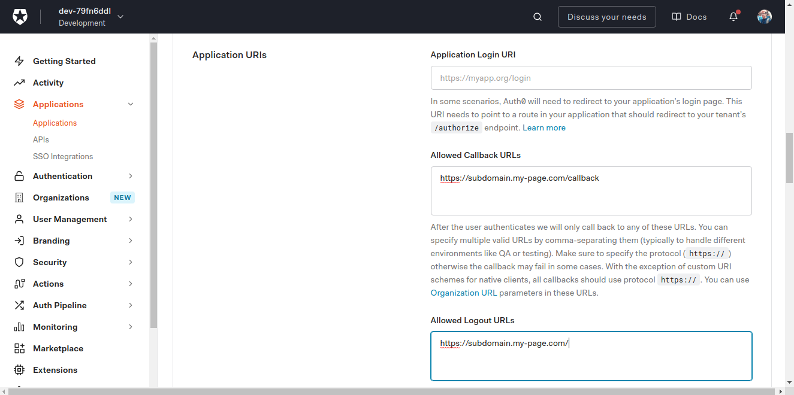
</h1>
<h1 align="center">
  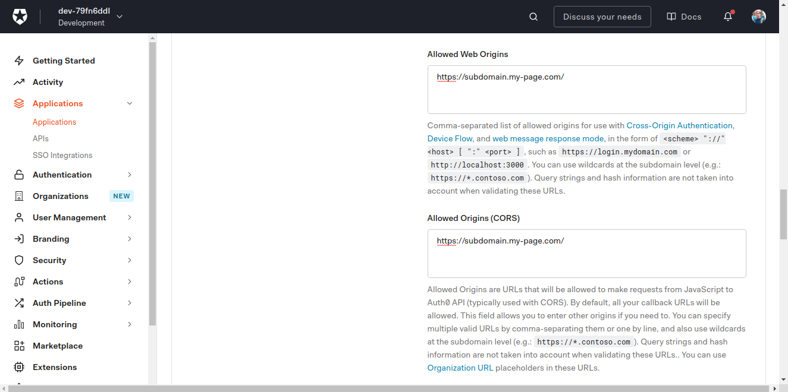
</h1>

Ahora nos vamos a la pestanha de "Connections" y quitamos la opcion de "Username-Password-Authentication".

<h1 align="center">
  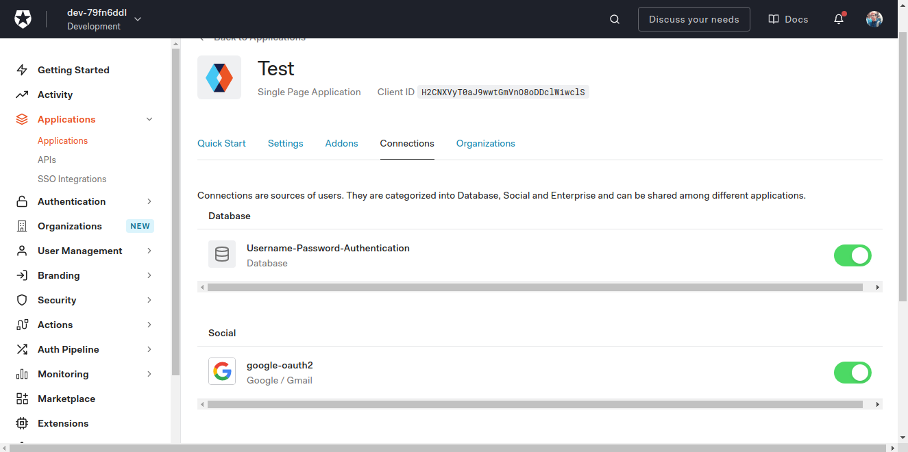
</h1>
<h1 align="center">
  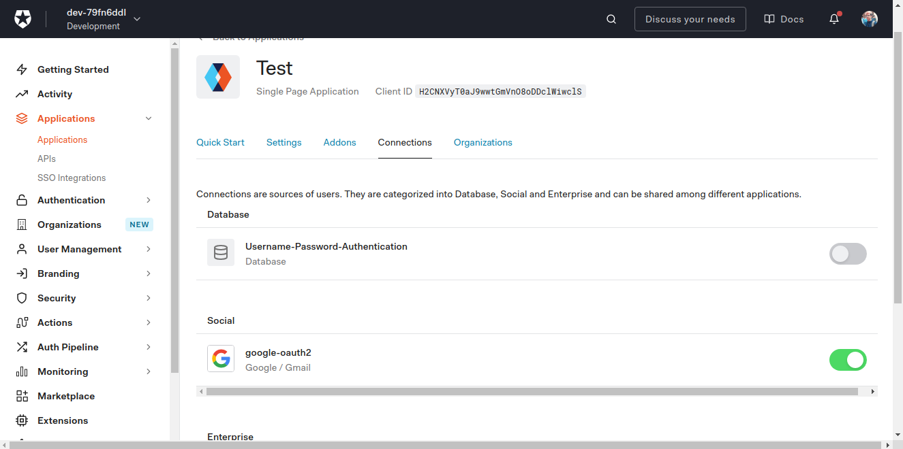
</h1>

Listo, ya puede ser usada en app externas, solo tiene que copiar el "Domain", "Client ID" y "Client Secret" y configurarlo en su app.
